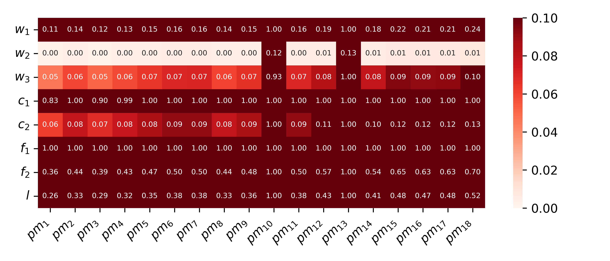
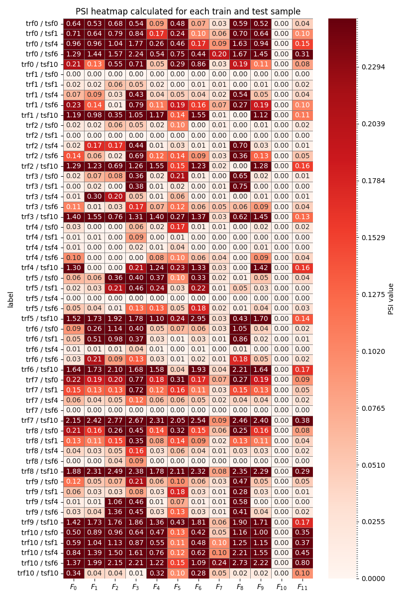
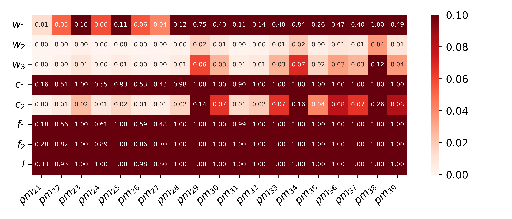

**Table: Feature names of the dataset and their abbreviations**

| Abb   | Description                               | Abb   | Description                             |
|-------|-------------------------------------------|-------|-----------------------------------------|
| F₀    | longest word length raw in domain         | F₁₀   | is port                                 |
| F₁    | url length                                | F₁₁   | longest word length in subdomain        |
| F₂    | path length                                | N₀    | upper case letter in tld domain         |
| F₃    | digits in path count                      | N₁    | word count in tld domain                |
| F₄    | domainlength                              | N₂    | confusables tld domain count            |
| F₅    | slash count                               | N₃    | underscore in path count                |
| F₆    | longest word length in tld domain         | N₄    | is http                                 |
| F₇    | digits in domain count                    | N₅    | query length                            |
| F₈    | upper case letter in path                 | N₆    | upper case letter in query              |
| F₉    | dash in path count                        |       |                                         |

**Table: Number of clear links (0) and phishing links (1) in each test (Ts) or training (Tr) fold**

| Fold | Tr 0    | Tr 1    | Tr Σ    | Ts 0    | Ts 1    | Ts Σ    |
|------|---------|---------|---------|---------|---------|---------|
| 0    | 26 208  | 8 761   | 34 969  | 164 619 | 19 762  | 184 381 |
| 1    | 98 771  | 11 857  | 110 628 | 177 282 | 17 746  | 195 028 |
| 2    | 106 368 | 10 648  | 117 016 | 198 519 | 16 464  | 214 983 |
| 3    | 119 111 | 9 878   | 128 989 | 181 594 | 14 514  | 196 108 |
| 4    | 108 956 | 8 708   | 117 664 | 282 016 | 14 705  | 296 721 |
| 5    | 169 209 | 8 823   | 178 032 | 290 373 | 12 262  | 302 635 |
| 6    | 174 224 | 7 357   | 181 581 | 440 267 | 4 436   | 444 703 |
| 7    | 264 159 | 2 662   | 266 821 | 375 512 | 4 695   | 380 207 |
| 8    | 225 307 | 2 817   | 228 124 | 128 558 | 4 304   | 132 862 |
| 9    | 77 135  | 2 582   | 79 717  | 43 320  | 40 562  | 83 882  |
| 10   | 25 992  | 24 337  | 50 329  | 58 161  | 17 020  | 75 181  |

